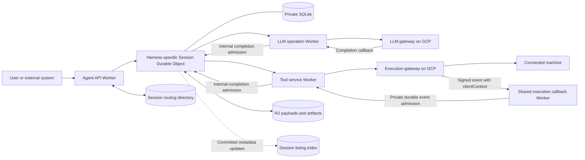

# Managed Agents: Intended Architecture

Status: implementation design, not a description of completed functionality.  
Last updated: 2026-09-20.

The deployed version is **`minimal-bash/v7`**. The implemented stack includes contracts, harness API, session runtime/driver, authenticated agent API, the minimal-bash harness, stateless LLM/bash operation workers and a shared execution callback router. See [deployment and configuration](DEPLOYMENT.md) and the [production benchmark](V7_PRODUCTION_BENCHMARK.md).

The runtime uses read-only transition plans with multiple outgoing operations, idempotent submission before atomic local commit, and small pending acceptance receipts. It does not persist outgoing requests or chunk JSON. V7 reduces SQLite row/index writes: ordinary integer primary keys for message/inbox sequences, no session sequence-counter write, `WITHOUT ROWID` pending receipts, and full-history context scans with in-memory filtering.

Both gateway callback paths use signed inline results and echoed host-owned routing context. Adapters have no D1/Queue/cron and acknowledge only after durable DO admission; gateway retries own accepted-job delivery. The harness publishes best-effort D1 display status without a publication ledger or status cron. Compaction, hard cancellation, additional tools and streaming remain future work. Exact current contracts are in the component READMEs; generic examples below remain architectural sketches.

For minimal-bash, a **model turn** is one LLM response plus all tool calls in that response; a **run** is the sequence of model turns answering a user request; a **session** is the persistent conversation containing many runs. All steering is included together at the next model-turn boundary. No lifecycle custom messages are generated; run state lives in the harness state row. Follow-ups belong to the consuming app.

This document consolidates the requirements and decisions from the task **“Plan system design requirements”** and the subsequent discussion in **“Assess Rust to WASM stack”**. It describes the system we intend to build in this repository, why its boundaries exist, and how to implement its first complete execution path.

**Decision labels:** “Agreed” records an explicit direction established in those discussions. “Initial design” records the proposed implementation approach. “Open” identifies something we have not finalized. Example names, schemas, routes, and TypeScript interfaces are illustrative unless explicitly identified as a fixed contract.

## Navigation

- [Purpose and requirements](#1-what-we-are-building)
- [Agreed decisions](#2-agreed-architectural-decisions)
- [System map](#4-system-map)
- [Repository, apps, and packages](#6-repository-structure)
- [Session identity and creation](#7-session-and-namespace-identity)
- [Persistence and harness transactions](#9-session-local-persistence)
- [Inbox, concurrency, and recovery](#11-inbox-admission-ordering-and-advancement)
- [Operations and dispatch](#13-external-operation-contract)
- [Complete execution flow](#15-complete-message-to-result-flow)
- [Tools and apply_patch](#16-tool-services-and-apply_patch)
- [Subagents, steering, waits, and cancellation](#18-subagents-steering-waits-and-cancellation)
- [Shared storage, R2, and Queues](#19-routing-directory-listing-index-r2-and-queues)
- [Migrations and releases](#20-migrations-and-release-management)
- [Failures and retries](#21-failure-and-retry-semantics)
- [Performance and cost](#23-performance-scaling-and-cost)
- [Development and validation](#25-development-and-validation)
- [Implementation sequence](#27-initial-implementation-sequence)
- [Open decisions](#28-open-decisions-register)
- [Alternatives and sources](#29-alternatives-considered)

## 1. What we are building

We are building a managed agents service capable of supporting tens of thousands of agent sessions, primarily coding agents. We implement and operate multiple harnesses. A caller creates a session with a supported harness/version and its initial configuration, then sends messages and other inputs to that session.

A harness determines the agent's behavior: instructions, model context, interpretation of results, tool selection, steering, user waits, cancellation, and when work is complete. The platform supplies reliable session execution and delivery of the harness's requested operations.

The user experience includes:

1. Create a session and select its harness/version.
2. Supply the configuration required by that harness, such as provider, model, reasoning level, and machine ID.
3. Send a message to start work.
4. Observe session status while the agent requests LLM responses and executes tools.
5. Send additional messages while work is running; the harness decides how to use that steering.
6. Answer requests for user input, request cancellation, or send another message after work completes.

OpenAI's Agents API and Anthropic's managed agents were product inspirations in the original discussion. This document specifies our own architecture; it does not claim to reproduce either provider's internal implementation.

### Workload assumptions

- Demand can be highly uneven: a few running agents followed by bursts of thousands.
- Many agents will be waiting for an LLM, a tool, or user input at any moment.
- The original estimate that 80–90% of agent time is waiting is a hypothesis, not a measured capacity input.
- A logical session must survive loss of the process or object instance that last advanced it.
- New input and operation results should trigger prompt progress. We do not intentionally add a one-second polling delay.
- Exact throughput, latency percentiles, payload limits, and cost budgets remain open.

## 2. Agreed architectural decisions

| Decision | Direction |
|---|---|
| Language | TypeScript for the initial platform and harnesses |
| Repository | A pnpm workspace monorepo with `apps/` and `packages/` |
| Session host | One Cloudflare Durable Object per session |
| Harness isolation | Separate Worker deployment and Durable Object namespace per harness/behavior version |
| Harness selection | A session runs one fixed harness/version, chosen at creation |
| Session configuration | Fixed after initialization; schemas can differ by harness |
| Session persistence | The object's private SQLite database is authoritative |
| Event handling | Exactly one logical input per handler call; process inputs sequentially |
| Handler responsibilities | Read-only deterministic plan; separate synchronous apply after submission receipts |
| Runtime placement | Shared library code running inside every session object |
| External work | Harnesses declare supported operations; host adapters dispatch only to implemented operation workers |
| Tool behavior | Tool services own their execution details and any tool-specific state |
| Subagents | Other ordinary sessions, created and interacted with through tools |

“One event per handler call” does not promise exactly one physical invocation. A failed, uncommitted attempt may be retried. The intended guarantee is that a logical input's local state transition is committed once.

## 3. Scope and boundaries

### This repository owns

- Session creation, identity, routing, and access checks.
- Session-local input admission, ordering, and deduplication.
- The harness integration contract.
- Harness state and history as designed by each harness.
- Replay-based outgoing submission and atomic local application of one input.
- Operation submission, correlation, completion admission, and recovery.
- Session status and read interfaces.
- Worker deployments for the API, harnesses, and initial tool adapters.

### Existing services remain independently owned

The user has already built two services, hosted separately on GCP:

| Service | Reported responsibilities |
|---|---|
| LLM gateway | Holds provider credentials, normalizes requests across providers, accepts jobs, exposes status/results, and delivers callbacks |
| Execution gateway | Connects to user machines through a host binary, exposes process/filesystem operations, tracks jobs, and delivers callbacks |

The user reports that submission retries recover the same logical jobs, completed results remain queryable, and callback delivery is retried. These are integration assumptions to verify against the actual APIs before implementing clients. This document is not an audit of either service.

We keep these services separate because they already own credentials, machine connectivity, execution, and their own scaling. This repository does not replace them or copy their internal databases.

### Outside the first implementation

- Hosting arbitrary unmodified agent programs or preserving an arbitrary async call stack.
- Building a general JavaScript checkpoint/replay engine for code-mode.
- A central scheduler that advances every session.
- A generic abstraction supporting every cloud or database.
- Global transactions spanning sessions, tools, gateways, and R2.
- Automatic guarantees of exactly-once remote side effects.

## 4. System map



The diagram shows logical roles, not a finalized count of databases. D1 currently provides both authoritative routing and the best-effort display-status listing. The R2 link is future work, not a provisioned runtime dependency.

Private host adapters submit to operation workers and route their completions to sessions. Operation-worker storage, internal queues and execution recovery are independent of the session runtime. The LLM and Pi-style bash workers implement this handoff contract; additional workers remain future work. The durable session inbox is the replay source; no pre-acceptance outbox exists.

## 5. Vocabulary and ownership

| Term | Meaning |
|---|---|
| Harness definition | A versioned implementation of agent behavior |
| Harness deployment | A Worker bundle containing one harness plus the common runtime |
| Durable Object namespace | The collection of session objects hosted by one exported class |
| Session | One durable agent identity, configuration, state, and conversation |
| Run/turn | A unit of work within a session; exact external identifiers remain open |
| Inbox event | A durably admitted input waiting to be consumed by the harness |
| Harness transition | Read-only plan, resolved submissions, and one atomic local commit |
| Planned operation | An in-memory request with a stable replay key/identity |
| Pending operation receipt | Small accepted-job correlation retained until completion handling commits |
| Provider job | Work accepted and tracked by a gateway or tool service |
| Tool instance | A longer-lived resource, such as a code-mode environment |
| Tool invocation | A particular request against a tool definition or instance |

Submission acceptance is distinct from execution completion. Accepted execution may remain pending for a long time; the worker owns that interval and result delivery.

## 6. Repository structure

### Current scaffold

The repository contains a private pnpm workspace, a lockfile, strict shared TypeScript configuration, and root recursive scripts. The milestone-one [contracts package](packages/contracts/README.md) and [harness API package](packages/harness-api/README.md) are implemented with boundary validation and focused runtime/type checks. Their source exports are the concrete reference for those interfaces.

The runtime, minimal-bash harness/host, authenticated API and LLM/bash operation workers are implemented and tested locally with D1 and SQLite objects. Their READMEs describe the implemented guarantees and deployment configuration. Additional tool workers remain future work; the layout below includes intended components, not only existing packages.

The existing workspace patterns are `apps/*` and `packages/*`. Keep initial workspace members at that depth.

### Intended layout

```text
managed-agents/
├── intended_architecture.md
├── package.json
├── pnpm-workspace.yaml
├── pnpm-lock.yaml
├── tsconfig.base.json
├── apps/
│   ├── agent-api/
│   │   ├── src/
│   │   │   ├── index.ts
│   │   │   ├── routes/
│   │   │   ├── auth/
│   │   │   └── harness-routing.ts
│   │   ├── package.json
│   │   ├── tsconfig.json
│   │   └── wrangler.jsonc
│   ├── harness-coding-v1/
│   │   ├── src/
│   │   │   ├── index.ts
│   │   │   └── session.ts
│   │   ├── package.json
│   │   ├── tsconfig.json
│   │   └── wrangler.jsonc
│   └── tools/
│       ├── src/
│       │   ├── index.ts
│       │   └── tool-registry.ts
│       ├── package.json
│       ├── tsconfig.json
│       └── wrangler.jsonc
├── packages/
│   ├── contracts/
│   ├── harness-api/
│   ├── session-runtime/
│   ├── harness-coding-v1/
│   ├── tool-apply-patch/
│   └── gateway-clients/
├── tests/
│   └── integration/
└── docs/
    └── architecture/
```

`coding-v1` is a placeholder for the first actual harness, not a finalized product name. Supporting directories should be created when they contain useful files.

### Apps are deployment boundaries

| App | Responsibilities |
|---|---|
| `agent-api` | Public API, authentication, routing, session creation, listing, and input admission endpoints |
| `harness-minimal-bash` | Coding session Durable Object, LLM/bash adapters, transcript reads and explicit D1 status publication |
| `llm-gateway-workers` | Stateless dedicated-user gateway submission with host-owned clientContext, signed inline callback verification and synchronous durable session admission; result retrieval only for terminal submission replay; gateway owns idempotency and delivery retries |
| `tool-pi-bash-workers` | Stateless dedicated-user execution.run submission with full clientContext, Pi-style inline-result formatting and synchronous durable session admission |
| `execution-gateway-callback-workers` | Stateless shared execution-user v3 webhook, signature verification, allowlisted structured forwarding to tools and acknowledgement after DO admission; no job submission or session access |
| `harness-coding-v1` | Export the concrete Durable Object class, compose runtime and harness, and configure the deployment's bindings and namespace |
| `tools` | Host simple external tool adapters, validate service requests, route by tool/version, and expose the operation contract |

Public session routes live in agent-api. LLM callbacks belong to the LLM operation worker. Execution-gateway callbacks belong to the shared callback worker, which authenticates inline events and routes by the gateway's echoed worker-generated `clientContext` to callback-only tool bindings. Both implemented tool/provider adapters are stateless and deliver normalized completions through private session admission; durability and retries live in their gateways. There is no shared tool database or separate job-to-tool mapping table. Agent-api does not host operation callbacks.

An app owns its Wrangler configuration, generated environment types, secrets/bindings, deployment scripts, and environment settings. A Durable Object class is exported from its hosting app; every object instance is not a separate deployment.

### Packages are code boundaries

| Package | Responsibilities |
|---|---|
| `contracts` | Shared wire schemas, event envelopes, IDs, operation requests, status/results, and callback envelopes |
| `harness-api` | In-process harness interface, capabilities of the handler context, and integration types |
| `session-runtime` | Common runtime state, fixed-schema bootstrap, inbox, transactions, read-only planning, replay submission, acceptance receipts, completion admission, and inbox recovery |
| `harness-minimal-bash` | OpenAI config, full native history, pending steering, serial bash cursor, run lifecycle and turn-boundary cancellation |
| `harness-coding-v1` | Illustrative harness config validation, fixed schema, initialization, context building, event handling, and behavior policy |
| `tool-apply-patch` | Patch-tool validation, conversion into execution-gateway requests, job-handle translation, and result translation |
| `gateway-clients` | Clients and transport mapping for the existing LLM and execution gateways |

Each package has its own `package.json`, TypeScript configuration, source, exports, and relevant tests. Use workspace dependencies for internal imports. They can remain private; package boundaries do not require publication to npm.

Keep tightly related runtime modules together:

```text
packages/session-runtime/src/
├── runtime.ts
├── driver.ts
├── context.ts
├── operation-identity.ts
├── bootstrap.ts
└── storage/
    ├── inbox.ts
    ├── operations.ts
    ├── progress.ts
    └── schema.ts
```

The inbox and dispatcher do not need separate packages. Initially the runtime can use Cloudflare APIs directly; a generic storage adapter package is not required.

### Dependency rules

- Apps import packages. Packages do not import apps.
- Contracts contain shared representations and validation, not service implementations.
- `harness-api` depends on shared contracts; it does not depend on a concrete harness.
- The runtime depends on the harness interface, not on the coding harness.
- The harness package depends on the interface/contracts; it does not own dispatch or import the tools app.
- The harness app composes the runtime and its one harness.
- Tool implementations may use gateway clients; the tools app composes them.
- App-to-app execution goes through service interfaces, not imports of another app's implementation.
- The API's harness registry contains routing metadata, not a bundle of every harness implementation.

An imported library runs in the importing service. It does not introduce a network hop.

## 7. Session and namespace identity

Each harness/behavior version has its own deployment and namespace:

```text
coding/v1 deployment
  ├── Session A: runtime + coding v1 + SQLite A
  └── Session B: runtime + coding v1 + SQLite B

coding/v2 deployment
  └── Session C: runtime + coding v2 + SQLite C

research/v1 deployment
  └── Session D: runtime + research v1 + SQLite D
```

Namespaces must exist through deployment before sessions are created in them. Addressing and invoking a new object activates that session dynamically. Application initialization is a method we implement, not an automatic creation of our SQL tables.

The public session ID resolves to a stable harness/version/object route. Do not allow a caller's submitted harness name or object ID to bypass the pinned route.

**Implemented:** opaque `ses_<UUID>` IDs and an authoritative D1 directory. Each row stores harness, metadata and a unified lifecycle/display status while pinning the route, creation request ID and canonical SHA-256 hash, not the full request. A globally unique `creation_request_id` makes reservation safe under concurrent retries. The object is addressed using the full public ID as its name in the pinned namespace. Request-scoped D1 sessions use `first-primary`; input/read routing selects only route and status. Current source and live routing support `minimal-bash/v5` only. Retained older directory records remain visible but cannot be resumed through the new registry.

## 8. Session creation and initialization

Implemented minimal-bash creation envelope (replace example resource UUIDs with real ones):

```json
{
  "requestId": "creation-request-id",
  "harness": { "id": "minimal-bash", "version": "v5" },
  "config": {
    "provider": "openai",
    "modelId": "gpt-5.6-sol",
    "accountId": "11111111-1111-4111-8111-111111111111",
    "reasoning": "medium",
    "machineId": "22222222-2222-4222-8222-222222222222",
    "cwd": "/workspace/project"
  },
  "metadata": { "title": "Coding session" }
}
```

The shape of `config` belongs to the chosen harness. Credentials remain in the systems that own them; session configuration can carry authorized references.

Initial flow:

1. Authenticate the caller and resolve the deployed harness/version.
2. Reserve or recover the session identity using the creation request key.
3. Record sufficient routing information to retry initialization.
4. Invoke the selected object's initialization method.
5. Bootstrap the fixed runtime/harness schema once if absent; validate config and resolve defaults.
6. Atomically persist identity, resolved config and harness initial state. No initialization alarm, processing kick, operation, prompt message or D1 status write occurs in the DO.
7. The API changes D1 status from `initializing` to `idle` and returns the session. Duplicate creation cannot overwrite a later harness status.

Initialization must be idempotent: the same identity and config recover the existing result; conflicting configuration is rejected. A creation record may remain `initializing` until the object confirms completion.

The routing store and session SQLite do not share a transaction. A lost initialization response must not create a second session. Invalid config becomes `initialization_failed`; correcting content needs a new request ID. The API compares canonical request hashes, ignoring object-key order but preserving array order. Transient failures retain `initializing` and return 503; a backend retry resumes initialization. The DO checks identity and reuses resolved config without revalidation. There is no creation/status sweeper. Reads/admission reject initializing, initialization_failed and destroyed; other display statuses are not execution gates. See [the concrete API and recovery contract](apps/agent-api/README.md).

## 9. Session-local persistence

The replay runtime keeps four tables in the session's SQLite database:

| Table | Contents |
|---|---|
| `runtime_session` | Identity, resolved config, created time and last allocated input sequence. |
| `runtime_inbox` | Ordered event, canonical hash, inline pending body, consumed time, and per-head retry/error/blocked metadata. Consumption releases the body; hashes remain. |
| `runtime_pending_operations` | Accepted-job receipts: operation ID, source input sequence, operation key, provider and job ID. Removed when completion handling commits. |

There is **no outgoing request persistence**, outbox, historical operation/outcome ledger or separate progress table. The durable replay source is the unconsumed input plus committed harness state/config/code. Pending receipt rows do not store requests or results.

Harness tables remain separate. Minimal-bash has messages, pending steering and execution state/cursor. All messages/events are inline JSON; no chunk tables remain. An idle user message is appended directly by the local commit, without first staging it. Only steering/held messages are pending. No generated run-started/finished/cancelled custom transcript entries remain.

All tables bootstrap once in one transaction. There is no SQL migration history; a changed runtime/harness version gets a fresh namespace.

## 10. Harness interface and transaction boundary

The deployed harness stores inline JSON only and bounds individual results/messages. See the [rollout procedure](apps/harness-minimal-bash/README.md#setup-and-rollout).

The [harness contract](packages/harness-api/README.md) separates deterministic decisions from writes:

```ts
interface TransitionPlan<Changes> {
  changes: Changes; // JSON-compatible and in-memory only
  operations: readonly (OperationRequest & { key: string })[];
  status?: HarnessStatus;
}
// Synchronous hooks on HarnessDefinition<Config, Input, Changes>:
handle(input, readContext): TransitionPlan<Changes>;
apply(changes, writeContext): undefined;
```

`handle` may read committed harness tables and frozen config. It must not write, use clocks/randomness, perform external I/O or depend on mutable process state. It reconstructs exactly the same decisions after activation loss. `operationId(key)` is pure, stable and available before submission so the plan can reference outgoing operations.

The runtime validates the entire plan and submits its operations **before** calling `apply`. Then one local transaction:

- applies the proposed harness writes;
- records accepted-job receipts;
- queues immediate/rejected completion events;
- consumes the source input and releases its inline body;
- removes the pending receipt for any completion being consumed.

Multiple independent operations are allowed per handle; order in the array does not imply execution order. Minimal-bash keeps its tools serial by requesting dependent work in later handles. Each operation has a unique stable key in its transition.

Only the local commit is all-or-nothing. External effects may already have occurred if commit fails or another operation rejects. Recovery must replay the same identities, not issue replacement work. `changes` and outgoing payloads are never persisted as a second plan/outbox.

Initialization remains synchronous local-only. Optional status intent is published best-effort after local commit, never stored as DO display status. SQL contexts expire when the hook returns; harness code is trusted and must not read/write runtime tables or retain cursors.

## 11. Inbox admission, ordering, and advancement

Admission still authenticates/routes at agent-api, snapshots/validates input at the DO, pre-arms a recovery wakeup, deduplicates by event ID/hash, assigns a sequence and persists the event. The driver kicks background processing before returning. Acceptance means durable retention, not completed handling.

The single processor does:

```text
load oldest pending input
  -> read-only handle / validate complete in-memory plan
  -> submit independent operations (bounded concurrency)
  -> wait for every acceptance or definitive rejection
  -> atomically apply changes + receipts + consume source
  -> publish explicit display status
  -> process next pending input
```

Throws/timeouts mean unknown acceptance. They keep the source pending, with backoff. While warm, resolved sibling receipts and the plan stay in memory; after restart all submissions replay under the same IDs. Later inputs/completions can be admitted, but their handlers cannot overtake that source input. This submission barrier is an explicit tradeoff.

A definitive rejection becomes `runtime.operation.completed` with a submission-origin failure and null job ID. Accepted siblings are not rolled back. Immediate completions queue through the same inbox mechanism, not recursively into the harness.

## 12. Concurrency, wakeups, and recovery

One driver per object serializes short admissions/planning/commits/alarm changes. It never holds that admission lock across provider calls. Different sessions progress independently. Submission concurrency defaults to eight, with no operation-count limit.

Input/completion admission establishes a recovery alarm **before** commit. Processing/alarm slices pre-arm too. The final alarm decision uses only the pending inbox head, serialized against new admissions. Blocked heads have an explicit recovery path and no automatic hot retry loop.

Unknown submissions retry with jittered backoff. Repeated deterministic prepare/apply failures block the head; an explicit operator resume retries it without skipping it. Initialization schedules no alarm. Accepted jobs alone also schedule no alarm: workers own their delivery, so a session can become inactive while awaiting a result.

Heap state is only a cache. Correctness after reactivation comes from the input, committed harness state, pinned code/config and worker idempotency. Detailed defaults and failure behavior are in the [runtime contract](packages/session-runtime/README.md).

## 13. External operation contract

The runtime's provider interface exposes only `submit(submission, signal)`:

- `accepted { jobId }`: worker durably owns execution and result delivery.
- `completed { jobId, outcome }`: accepted and already terminal.
- `rejected { error }`: definitive non-acceptance.
- Throw/timeout: acceptance unknown; retry the same identity/content.

Identity is derived from session ID, harness ID/version, source input sequence and stable operation key. The compact ID includes the input sequence and SHA-256 of the tuple. Both wire fields `operationId` and `submissionId` use that identity. A model tool-call ID alone is not sufficiently scoped.

Workers must preserve idempotency through the recovery horizon, including after an early completion. Same identity/content recovers the same job/rejection; changed content conflicts. No automatic retention window is introduced here. There is no exactly-once guarantee for arbitrary machine side effects.

The harness declares allowed provider/type/version combinations. The host binds only implemented workers and chooses destinations/authentication. The runtime rejects any undeclared operation before submitting the batch. Worker D1/Queue/gateway choices are outside the harness contract.

Private Worker `submit` takes a structured object and returns `{ result: ProviderSubmitResult }`. The host uses `parseProviderSubmitReply` to validate nested JSON and dispose Cloudflare's outer RPC result object. Both stateless adapters remove diagnostic `get`. Hard cancellation is not implemented.

## 14. Replay dispatch and completion

Gateway callbacks go to operation workers, never agent-api. The stateless LLM adapter supplies `{ routeKey, sessionId, operationId, submissionId }` as per-job gateway `clientContext`. Its receiver verifies the signed context and inline schema-v2 result, then forwards to the allowlisted DO without a gateway GET, D1 mapping, Queue or cron. It returns 204 only after durable admission; admission failures return 503 for gateway retry. Terminal submission replay still fetches job detail and returns the outcome inline. Execution now uses a stateless shared signed v3 callback router and bash adapter, with full routing context and inline result; acknowledgement follows DO admission without a local ledger.

At the DO, completion admission checks `{ operationId, submissionId, provider, jobId, outcome }` against a pending receipt. If submission has not locally committed, it validates against the cached/reconstructed head plan instead. The event is admitted behind its source input in the existing inbox. No special early-result table exists.

Duplicate completion hashes return the same receipt even after body cleanup and pending-row removal. Conflicting correlation/content is rejected. Both gateways mark delivery after our synchronous callback acknowledgement following that receipt. Neither adapter keeps a local delivery ledger. Harness processing may happen later.

There is no DO status reconciliation. Gateway webhook retries recover callback/admission failures and lost receipts for both LLM and execution. Each gateway currently has eight attempts, a 24-hour retry-window cap and a ten-second callback timeout; our whole callback budget is eight seconds. Exhaustion can leave a session waiting and requires gateway redelivery, not independent Worker recovery. No bash/router D1/Queue/cron remains. A missing accepted upstream job never authorizes blindly executing the command again.

## 15. Complete message-to-result flow

```text
user -> agent-api -> session inbox (prearmed, durable receipt -> user)
                        |
                        v
                 harness read-only plan
                        |
                        v
               operation worker submit
                 (durable job ownership)
                        |
                        v
        local commit: harness changes + small receipts + consume
                        |
              session can become inactive
                        |
gateway callback -> operation worker -> session completion inbox
                        |
                        v
        next read-only plan -> submissions -> next local commit
```

Full LLM history is built from committed transcript plus proposed messages. It is sent without a separate SQLite request copy. Completion data exists in the inbox until consumed, then relevant assistant/tool messages remain in harness history.

## 16. Tool services and apply_patch

Tools are external operations from the harness's perspective. Different tools can have different hosting and state requirements while presenting the same operation semantics.

### Initial apply_patch design: a thin adapter

Host `packages/tool-apply-patch` in `apps/tools`. The tool translates one invocation into one durable execution-gateway job that runs the patch implementation on the selected machine.

```text
harness records apply_patch operation A
    -> session transaction commits
    -> dispatcher submits A to tools service
    -> apply_patch adapter submits gateway request derived from A
    -> gateway accepts execution job E
    -> adapter returns tool handle T backed by E
    -> runtime records A -> T
    -> completion enters the session inbox
```

The adapter validates input, translates submission, exposes status/cancellation, and translates outcomes. It may not need its own database if it can reconstruct all required information from the handle, request, and durable gateway job.

A stateless adapter still needs a complete callback path. Either the gateway delivers sufficient authenticated correlation metadata to the final destination, or it calls a translating tool endpoint whose retries safely reach that destination. The adapter must not acknowledge and discard a gateway callback before downstream delivery is recoverable. The existing gateway contract determines which option to implement.

Do not invent a tool job ID and report acceptance before a durable owner accepts the work. If the adapter crashes after gateway acceptance, resubmission must recover `E`.

### Composite tools

If a tool coordinates several independent gateway jobs, it needs durable coordination for those steps. A per-invocation ToolOperation Durable Object is one possible implementation. That service then owns its own job identity, step state, and reliable completion delivery.

This is an internal tool decision. It should not change how the harness records an operation.

### Packaging versus deployment

Simple tools may share `apps/tools` while keeping individual implementation packages. A dedicated `apps/tool-apply-patch` can later import the same package if independent deployment becomes useful. There is no requirement for one Worker per tool or one global object serializing every invocation.

### Remote side effects

Recovering one gateway job is not proof that a remote file mutation happened exactly once. If an execution process changes files and crashes before reporting success, the execution owner must reconcile or expose uncertainty. The dispatcher must not blindly rerun the actual patch as if it were merely retrying delivery.

A revised patch chosen after a completed failure is a new logical operation with a new ID.

## 17. Stateful tools and code-mode

Code-mode is an example of a tool with an environment, multiple cells, and nested execution-gateway operations. Its implementation and hosting are deliberately deferred.

Distinguish four lifetimes:

| Scope | Example |
|---|---|
| Definition | Version of `code_mode.exec` |
| Instance | A session's JavaScript environment |
| Invocation | Execute one cell |
| Nested operation | A command requested by that cell |

The session stores handles and outcomes. The tool service owns its environment and nested execution state.

The user explicitly accepted that a code-mode host crash can interrupt the environment/cell; the model or harness can react and retry. This platform does not promise transparent restoration of an arbitrary JavaScript heap, pending promises, or stack. Ordinary persistence across successful cells and recovery after host failure are separate guarantees.

Tool internals must not become responsibilities of the common session runtime. A persistent tool can use a conventional server, container, or another appropriate host while the session still runs in a Durable Object.

## 18. Subagents, steering, waits, and cancellation

### Subagents

One agent corresponds to one session. A spawn tool creates another ordinary session; that child progresses independently using the same infrastructure. Messaging, inspection, and waiting can also be tools that call the agent service.

Initial proposal: spawning completes when the child is durably created and returns its session ID. Waiting for a child's work is a separate operation. Define the run/turn or event being awaited, since a session can remain available after completing work.

Parent/child references support inspection and any selected permissions, accounting, or cancellation policy. Exact policy is harness-specific or still open; a parent stopping does not implicitly authorize a universal cascade rule.

### Steering

Every steering message enters the inbox. A waiting harness may save it in pending-steering tables and return. A different harness may request cancellation or prepare another operation. The runtime supplies ordered inputs and reliable effects, not one steering policy for every harness.

### User waits

The harness can request user input and persist the state needed to interpret a resolution. Resolutions arrive as inputs. Wait IDs, deadlines, stale-resolution behavior, and whether other operations continue while waiting require explicit contracts.

### Cancellation

A cancellation request is an input to the harness. The harness decides which outstanding operations or children should receive cancellation requests. Those external requests use durable delivery mechanisms as well.

Cancellation can race with completion and cannot undo completed external side effects. The runtime must retain outcomes and avoid corrupting terminal state; the harness decides how a late result affects its conversation.

Implemented minimal-bash policy is intentionally softer: mark `cancelling`, finish the current model response and all of its serial tools, then stop before another model request. No upstream cancellation is sent. Queued messages remain held until explicit resume, which starts a new run. Hard cancellation, timeout escalation and child cascades remain future work.

### Visible status

The public status enum is `initializing`, `initialization_failed`, `idle`, `running`, `failed`, `cancelling`, `cancelled`, `waiting`, and `destroyed`. The API owns initialization and initial idle. The harness explicitly selects subsequent display statuses when its lifecycle changes; the runtime does not infer them from phase or processing errors. Minimal-bash does not use waiting. Destroyed is reserved for retirement, with no destroy endpoint yet.

Visible status is not a statement about CPU activity. A session can be `running` while its object is inactive. Multiple pending operations or a user wait may require richer state than one status field. Session lifetime and the completion of one run are also different concepts.

## 19. Routing directory, listing index, R2, and Queues

### Directory and index

The session object is authoritative for session state. A global listing/filtering view can be an eventually consistent projection of committed metadata updates.

Routing and creation idempotency must not depend blindly on a stale projection. The routing directory needs a stable harness/object identity that can support reliable admission. If the same database holds both roles, distinguish authoritative directory fields from projected status fields.

Step 3 implements authoritative routing, creation recovery, metadata and status listing in D1. Avoid a single global coordinator object in every session's transition path.

Minimal-bash publishes explicit status after commit using nonblocking D1 writes ordered within an activation. No display-status row, revision, retry ledger or status cron exists in the DO/host. A failed/lost write can leave status stale until a later explicit transition; cross-activation write ordering is not guaranteed. Execution phase/cursors remain locally durable and independent of display status. The final D1 schema is a fresh-database `0001_initial.sql`; the earlier v2 rollout used a fresh directory. V4 reuses that D1 schema/database and creates a fresh DO namespace; it does not rerun an edited 0001.

### R2

Use R2 for large attachments, results, artifacts, and potentially archived history. SQLite retains references and the information needed to advance the session.

For a required immutable payload, the proposed ordering is upload successfully first, then commit the referencing record. There is no cross-store transaction; crashes can leave unused uploads for cleanup. Retention must avoid deleting objects still referenced by recoverable session state. Thresholds, limits, cleanup, and authorization are open.

### Queues

Current session-to-worker submission is direct private RPC. LLM and execution callbacks are stateless adapters; neither uses Queues or D1. The upstream gateways' durable webhook systems own accepted-job delivery retries. Retained remote resources from older deployments require separately approved cleanup.

A future queue-backed submit adapter must durably accept the work and own execution/result delivery before returning acceptance. An uncertain enqueue must replay with the same ID. Do not reintroduce a session request outbox implicitly or change the API receipt from "durably in the session inbox" to "only in a transport queue" without a separate architectural decision.

## 20. Migrations and release management

Each harness version pins its runtime code, harness code and fixed SQL schema in its own namespace. Preserve build artifacts for diagnosis and for any old namespace that remains deployed.

Cloudflare class/namespace lifecycle configuration is separate from SQL schema migration. Declaring a SQLite-backed class does not create our application tables. Use the current Wrangler configuration supported by the pinned tooling rather than copying an old example mechanically. [Class exports](https://developers.cloudflare.com/durable-objects/reference/durable-objects-migrations/)

Fixed schema strategy:

- Runtime and harness each provide bootstrap SQL statements.
- On activation, one existence check decides whether bootstrap is needed.
- Create all runtime/harness tables in one atomic transaction when absent.
- Keep no migration history or schema validation/diff engine; existing objects skip bootstrap.
- Resolve config defaults once and persist only that result. Initialization writes session/harness state atomically.
- Deploy changed code/schema under a new harness version/namespace. Do not mutate a namespace's pinned deployment in place.

The current deployment uses `minimal-bash/v7` / `MinimalBashSessionV7`. Existing sessions are not upgraded, copied or deleted. Preserve older host/code/data; pause traffic and drain old work before switching namespace bindings. See [deployment guidance](DEPLOYMENT.md).

An old namespace is not immutable by itself: rebuilding its app against changed workspace dependencies changes its code. Preserve release artifacts and compatibility discipline when maintaining old behavior versions.

A shared runtime fix reaches a harness only after that app is rebuilt and deployed. A monorepo commit is not an atomic multi-service rollout. This breaking rollout requires draining and a maintenance window; mixed old/new protocols are not supported.

## 21. Failure and retry semantics

| Failure or race | Intended outcome |
|---|---|
| Duplicate message delivery | Recover original admission; do not create another logical input |
| Crash after input commit, before processing | Durable wakeup resumes the pending input |
| Preparation fails | No external work or local changes; input remains pending |
| Crash after remote acceptance, before local commit | Reconstruct plan and replay identical IDs, then commit locally |
| Provider accepts, submission response is lost | Retry same identity and recover existing provider job |
| Callback arrives before acceptance is stored | Validate reconstructed plan; admit event behind the source |
| Callback repeats | Preserve one logical completion event |
| Mixed acceptance/rejection batch | Commit accepted receipts and synthetic rejection events; no remote rollback |
| Callback is lost | Operation worker owns gateway reconciliation and delivery retry |
| Object is evicted or deployment replaces instance | Reconstruct from durable records |
| External operation finishes with a business error | Deliver outcome; harness decides the next action |
| Tool host crashes with uncertain external effects | Preserve/report uncertainty according to provider contract |
| Runtime handler has a persistent bug | Record/alert and expose recovery; do not retry in a hot loop forever |
| Session initialized but creation response is lost | Recover original identity and initialization result |
| Index update is delayed | Authoritative session continues; listing may temporarily lag |

Separate delivery retries from intentional re-execution. Runtime retries uncertain submissions; workers recover accepted jobs/delivery; the harness chooses new work after a result.

Liveness assumes the platform and dependencies eventually become available and errors are recoverable. Head retry/block policy is implemented; administrative recovery tooling remains future work.

## 22. Security and tenant boundaries

Initial design requirements:

- Authenticate public callers and authorize access to sessions and requested resources.
- Verify callback/service identity and correlate it with the expected provider and operation.
- Scope idempotency keys and job access to the correct session.
- Validate external payloads at runtime; TypeScript types alone do not validate network input.
- Keep provider credentials in the existing credential-owning services where possible.
- Carry only the delegated authority needed to access a machine, tool, or child session.
- Avoid exposing raw secrets, sensitive prompts, or unrestricted payloads in operational logs.
- Apply resource limits at admission and execution boundaries after selecting concrete limits.

**Step 3 authentication:** one trusted backend sends `Authorization: Bearer <BACKEND_TOKEN>`. Missing secrets fail closed. All public JSON request bodies are capped at 64 KiB. End-user login, roles and gateway credential delegation remain open.

## 23. Performance, scaling, and cost

The architecture scales by independent sessions. It does not need one permanently running process per agent. A logical object can remain stored while consuming no active harness execution.

Size the system from work, not just session count:

```text
transition CPU demand ~= transitions/second * CPU time/transition
storage demand        ~= events/second * rows and bytes accessed/event
dispatch demand       ~= operations/second + delivery retries
```

Measure the path from input/result arrival to the next committed action and provider acceptance. Break it into API routing, object activation, storage, harness CPU, dispatch, and gateway latency. The gateways are on GCP, so inter-cloud placement and network latency need measurement.

Ordinary Workers meter CPU time; Durable Objects meter active/non-hibernatable wall-clock duration with a fixed memory allocation. Consequently, minimizing unnecessary active waits matters for this architecture. Rust/Wasm was considered but is not the initial choice: it does not automatically make orchestration faster or cheaper. Revisit it only for measured computation-heavy components. [Workers pricing](https://developers.cloudflare.com/workers/platform/pricing/), [Durable Objects pricing](https://developers.cloudflare.com/durable-objects/platform/pricing/)

Initial optimization priorities:

- Keep harness transitions bounded and load only necessary history.
- Submit jobs and return instead of waiting for full execution.
- Use prompt callbacks; keep accepted-job recovery in the operation workers.
- Avoid unnecessary token-by-token state-machine transitions.
- Bound submission concurrency and retry amplification.
- Measure downstream gateway capacity during bursts; object scaling does not remove provider limits.

A shared delivery service becomes attractive when tenant fairness, provider-wide limits, or slow acceptance endpoints justify it. Accepted-job execution/recovery ownership belongs to its operation worker; the session owns its next decision.

## 24. Streaming, reads, and retention

The current implementation has session status reads but no output-event contract or storage. Observable result streaming is deferred until there is a concrete consumer and transport requirement.

Open choices include:

- SSE, WebSockets, or another client transport.
- Persist every token/result chunk versus only completed messages/results and selected events.
- Whether progress chunks bypass the harness inbox and how they are correlated with committed operations.
- Result ordering, reconnect cursors, replay limits, and retention periods.
- Large history/result thresholds and archive behavior.

Do not assume that persisting final results also preserves every live chunk. Do not introduce an output-event stream or route every token through the harness without a requirement and cost analysis. Client connections must be considered when evaluating object activity and duration costs.

## 25. Development and validation

Use the existing strict TypeScript and pnpm workspace setup. Add Wrangler per-app configuration and generated binding types as apps are introduced. Internal packages can export TypeScript source for bundling; a separate published build for every library is not required initially.

Run collaborating Workers together locally where possible. Cloudflare supports a single Wrangler invocation with multiple configurations. [Multi-Worker development](https://developers.cloudflare.com/workers/local-development/multi-workers/)

```sh
pnpm exec wrangler dev \
  -c apps/agent-api/wrangler.jsonc \
  -c apps/harness-coding-v1/wrangler.jsonc \
  -c apps/tools/wrangler.jsonc
```

That future command becomes usable as the remaining apps are introduced. Today `pnpm dev` starts only agent-api; run the minimal-bash host and operation workers separately with the required bindings and credentials. Local integration tests use fake gateways and require no account setup.

Use ordinary unit tests for harness decisions and contract validation. Use Workers-runtime integration tests for SQL rollback, namespace bindings, alarms, and lifecycle behavior. Test gateway adapters against the actual gateway contracts or representative contract fixtures.

Essential behavior to verify:

1. Retryable creation and initialization, including response loss.
2. Duplicate/conflicting input IDs and session-local order.
3. Atomic commit/rollback across harness changes, input consumption and acceptance receipts.
4. Recovery after admission or transition commit without another user message.
5. Stable provider identity across uncertain submissions.
6. Completion-before-acceptance and duplicate callback races.
7. Worker-owned missing-callback recovery; no session polling.
8. Alarm rescheduling, concurrent admission, and bounded processing continuation.
9. Fixed-schema bootstrap and deterministic state/operation replay on reactivation.
10. Harness-specific steering, waits, and cancellation behavior.
11. Cross-tenant rejection for session, callback, and tool access.
12. Burst behavior, latency distribution, and downstream backpressure.

Passing an in-memory mock test alone is not evidence that the actual transaction/wakeup protocol is correct.

## 26. Observability and operational recovery

Correlate requests using session ID, input ID, local operation ID, provider job handle, harness version, and deployment/runtime version.

Useful measurements include admission-to-transition delay, transition duration, oldest pending inbox age, pending operation age, submission latency, retry counts, worker recovery success, duplicate callbacks, migration failures, and time until the next operation is accepted.

Logs should distinguish delivery failure, execution failure, and harness failure. Operators need a way to inspect why a session stopped making progress and resume recoverable work without manually inventing new operation IDs.

Retention, alert thresholds, support tooling, and administrative recovery endpoints remain open. They are production requirements, not reasons to put a global scheduler in the normal session path.

## 27. Initial implementation sequence

Build one working path before multiplying harnesses and tools.

The implementation discussion consolidated the work into six milestones:

1. **Local session core — complete:** shared contracts/harness interface, fixed-schema bootstrap, initialization, inbox deduplication, synchronous transactional handlers and test-only harness fixtures.
2. **Durable operations — complete:** deterministic multi-operation plans, replay submission, atomic commit, pending receipts, completion admission and inbox recovery; worker-owned accepted-job delivery.
3. **Authenticated API — complete locally:** simple trusted-backend auth, D1 directory and listing, retryable creation, deployment routing, input admission and restart/failure tests.
4. **Real LLM integration — complete locally:** `llm-gateway-workers` handles gateway submission and signed inline callback delivery; minimal-bash supplies the session host, full-history context policy and adapter. Live setup/validation remains.
5. **Tool execution — bash complete locally:** `tool-pi-bash-workers` submits `execution.run`, returns a bounded tail/full-log reference and delivers results. Minimal-bash completes the model → serial tool → model cycle. Apply_patch and hard operation cancellation remain future work.
6. **Minimal coding harness — complete locally; hardening remains:** config/account references, native transcript, batched steering, graceful cancellation/resume, read APIs and directory projection are implemented. Next: compaction, user waits, hard cancellation, streaming, retention/quotas and measured burst behavior.

The exact implemented wire contracts live in `packages/contracts`; app/runtime READMEs distinguish current guarantees from future work. Gateway transport belongs to the independent LLM and bash operation workers; the removed gateway-client package is not required. Operation inputs allow 8 MiB of in-memory JSON; outcomes and individual message rows are capped at 1,900,000 UTF-8 bytes. SQLite storage is inline only: chunk tables and the shared chunk helper were removed. Oversized gateway results deliver a small failure and mark the harness failed; oversized harness message rows fail during planning rather than poisoning SQL writes. R2 references remain future work. API bodies remain capped at 64 KiB. Minimal-bash does not estimate context tokens locally: the provider's terminal context-overflow error fails the run. No compaction is implemented. Bash returns bounded text plus a machine-local full-output file reference owned and expired by the execution host.

## 28. Open decisions register

| Topic | What still needs a decision |
|---|---|
| First coding harness | Minimal-bash is implemented; future harness variants and broader tools |
| Identity/routing | Reservation retention/cleanup and future deployment retirement; Step 3 uses opaque IDs, D1 and retryable creation |
| Listing | Explicit best-effort D1 status publication is implemented; no cron repair; filtering and staleness handling remain |
| Gateway integration | Longer-term result retention and whether full-history submission should later use gateway continuation as an optimization |
| Callback flow | Tool callback translation and authentication |
| Runtime schema | Concrete tables, indexes, statuses, and retention constraints |
| Wakeup protocol | Exact admission/commit/alarm ordering validated under failure and interleaving |
| Handler failures | Retry budget, poison inputs, blocking behavior, and operator recovery |
| Session/run lifecycle | Minimal-bash semantics are implemented; broader harness policies and hard cancellation remain |
| User waits | IDs, expiry, stale resolutions, and relationship to parallel work |
| Cancellation/children | Harness-specific cascade rules and authority propagation |
| Streaming | Transport, retained chunks, reconnect/replay semantics |
| R2 | Payload thresholds, object naming, lifecycle, cleanup, and authorization |
| Capacity | Event rate, payload sizes, burst targets, latency SLOs, and budget |
| Delivery controls | Backoff, timeouts, concurrency, quotas, and when to introduce a shared dispatcher |
| Releases | Compatibility windows, retained versions, rollback and migration strategy |
| Security | Future end-user auth, roles and delegated machine access; Step 3 trusts one authenticated backend token |

Resolve decisions when they become prerequisites for implementation. Do not silently reinterpret an open item as an agreed requirement.

## 29. Alternatives considered

| Alternative | Why it is not the initial direction |
|---|---|
| Conventional shared harness service on GCP | Viable, but we chose per-session SQLite and managed object activation for uneven demand; it would require a different coordination/recovery host |
| One generic deployment containing every harness | Viable, but the explicit preference is a deployment/namespace per harness/version |
| Authoritative inbox in a shared database | Splits consumption and harness state across stores; local SQLite gives the desired transaction boundary |
| Shared runtime executing outside session objects | Adds a remote read/compute/commit protocol around session-private state |
| Rust/Wasm throughout | Feasible, but TypeScript gives direct platform integration; no measured CPU advantage justifies the extra boundary today |
| Queue on every interactive hop | Adds another delivery stage and acceptance semantics before a demonstrated need |
| One deployment per simple tool | Optional; a common tools app initially hosts separate tool packages |
| Whole-session in-memory agent loop | Does not provide the intended recovery and release-of-resources model |

## 30. Sources and maintenance

Conversation sources:

- **Plan system design requirements**, task ID `01a0adf4-e601-7963-b626-629f57f695d1`: requirements, service boundaries, session model, Durable Objects selection, per-harness namespaces, tools, and runtime placement.
- **Assess Rust to WASM stack**, task ID `01a0af84-36d0-72b0-8571-78725324947a`: TypeScript selection, cost reasoning, monorepo, apps, and packages.

Platform references used during the discussions and this consolidation:

- [Durable Objects overview](https://developers.cloudflare.com/durable-objects/)
- [Namespace and object addressing](https://developers.cloudflare.com/durable-objects/api/namespace/)
- [SQLite storage and transactions](https://developers.cloudflare.com/durable-objects/api/sqlite-storage-api/)
- [Alarms](https://developers.cloudflare.com/durable-objects/api/alarms/)
- [Object lifecycle](https://developers.cloudflare.com/durable-objects/concepts/durable-object-lifecycle/)
- [Class exports and namespace lifecycle](https://developers.cloudflare.com/durable-objects/reference/durable-objects-migrations/)
- [Workers monorepos](https://developers.cloudflare.com/workers/ci-cd/builds/advanced-setups/#monorepos)
- [Developing multiple Workers](https://developers.cloudflare.com/workers/local-development/multi-workers/)
- [Workers pricing](https://developers.cloudflare.com/workers/platform/pricing/)
- [Durable Objects pricing](https://developers.cloudflare.com/durable-objects/platform/pricing/)

As implementation progresses, update this document when a boundary or guarantee changes, move resolved open decisions into the relevant sections, and add concrete API/schema references. Preserve the distinction between intended behavior, implemented behavior, and measured operational guarantees.
