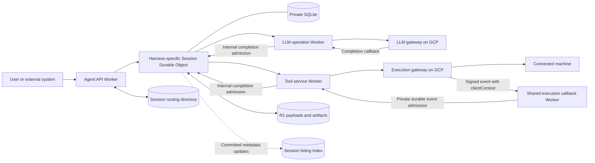
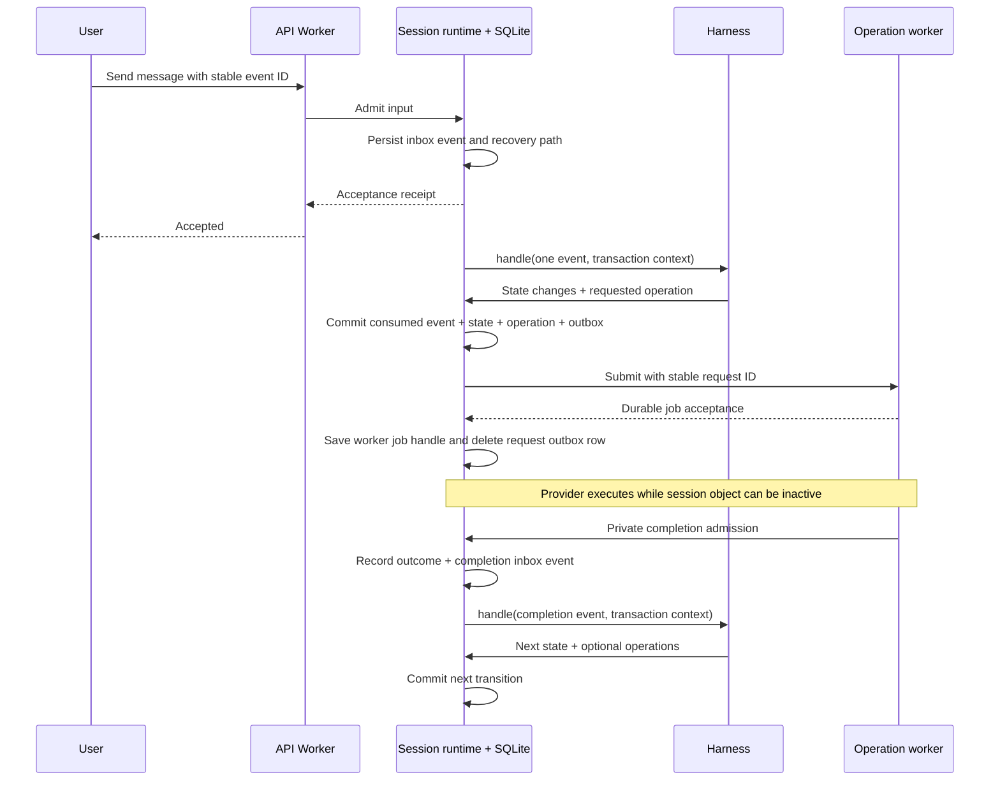

# Managed Agents: Intended Architecture

Status: implementation design, not a description of completed functionality.  
Last updated: 2026-09-18.

**Implemented so far — durable platform, operation workers and minimal-bash coding harness:** contracts, harness API, synchronous runtime and async driver, authenticated `agent-api`, LLM and Pi bash workers, and the shared execution callback router. The [minimal-bash harness](packages/harness-minimal-bash/README.md) implements the full OpenAI → serial bash → OpenAI loop, native transcript replay, batched steering and graceful turn-boundary cancellation. Its [host](apps/harness-minimal-bash/README.md) supplies private bindings, transcript reads and revision-guarded D1 status projection with scheduled repair. The operation workers own dedicated-user gateway calls, D1 routing/retry metadata, Queue delivery and recovery. Workerd tests exercise the real API, hosts, workers, callback router, SQLite and D1 with contract-compatible fake gateways; no live gateway end-to-end test or deployment is performed by these checks. Compaction, hard cancellation, additional tools and streaming remain future work. Exact current contracts and limits are in the linked READMEs; later generic examples in this document remain architectural sketches.

For minimal-bash, a **model turn** is one LLM response plus all tool calls in that response; a **run** is the sequence of model turns answering a user request; a **session** is the persistent conversation containing many runs. All steering is included together at the next model-turn boundary. Lifecycle custom messages are retained in the transcript but never sent to the LLM. Follow-ups belong to the consuming app.

This document consolidates the requirements and decisions from the task **“Plan system design requirements”** and the subsequent discussion in **“Assess Rust to WASM stack”**. It describes the system we intend to build in this repository, why its boundaries exist, and how to implement its first complete execution path.

**Decision labels:** “Agreed” records an explicit direction established in those discussions. “Initial design” records the proposed implementation approach. “Open” identifies something we have not finalized. Example names, schemas, routes, and TypeScript interfaces are illustrative unless explicitly identified as a fixed contract.

## Navigation

- [Purpose and requirements](#1-what-we-are-building)
- [Agreed decisions](#2-agreed-architectural-decisions)
- [System map](#4-system-map)
- [Repository, apps, and packages](#6-repository-structure)
- [Session identity and creation](#7-session-and-namespace-identity)
- [Persistence and harness transactions](#9-session-local-persistence)
- [Inbox, concurrency, and recovery](#11-inbox-admission-ordering-and-advancement)
- [Operations and dispatch](#13-external-operation-contract)
- [Complete execution flow](#15-complete-message-to-result-flow)
- [Tools and apply_patch](#16-tool-services-and-apply_patch)
- [Subagents, steering, waits, and cancellation](#18-subagents-steering-waits-and-cancellation)
- [Shared storage, R2, and Queues](#19-routing-directory-listing-index-r2-and-queues)
- [Migrations and releases](#20-migrations-and-release-management)
- [Failures and retries](#21-failure-and-retry-semantics)
- [Performance and cost](#23-performance-scaling-and-cost)
- [Development and validation](#25-development-and-validation)
- [Implementation sequence](#27-initial-implementation-sequence)
- [Open decisions](#28-open-decisions-register)
- [Alternatives and sources](#29-alternatives-considered)

## 1. What we are building

We are building a managed agents service capable of supporting tens of thousands of agent sessions, primarily coding agents. We implement and operate multiple harnesses. A caller creates a session with a supported harness/version and its initial configuration, then sends messages and other inputs to that session.

A harness determines the agent's behavior: instructions, model context, interpretation of results, tool selection, steering, user waits, cancellation, and when work is complete. The platform supplies reliable session execution and delivery of the harness's requested operations.

The user experience includes:

1. Create a session and select its harness/version.
2. Supply the configuration required by that harness, such as provider, model, reasoning level, and machine ID.
3. Send a message to start work.
4. Observe session status while the agent requests LLM responses and executes tools.
5. Send additional messages while work is running; the harness decides how to use that steering.
6. Answer requests for user input, request cancellation, or send another message after work completes.

OpenAI's Agents API and Anthropic's managed agents were product inspirations in the original discussion. This document specifies our own architecture; it does not claim to reproduce either provider's internal implementation.

### Workload assumptions

- Demand can be highly uneven: a few running agents followed by bursts of thousands.
- Many agents will be waiting for an LLM, a tool, or user input at any moment.
- The original estimate that 80–90% of agent time is waiting is a hypothesis, not a measured capacity input.
- A logical session must survive loss of the process or object instance that last advanced it.
- New input and operation results should trigger prompt progress. We do not intentionally add a one-second polling delay.
- Exact throughput, latency percentiles, payload limits, and cost budgets remain open.

## 2. Agreed architectural decisions

| Decision | Direction |
|---|---|
| Language | TypeScript for the initial platform and harnesses |
| Repository | A pnpm workspace monorepo with `apps/` and `packages/` |
| Session host | One Cloudflare Durable Object per session |
| Harness isolation | Separate Worker deployment and Durable Object namespace per harness/behavior version |
| Harness selection | A session runs one fixed harness/version, chosen at creation |
| Session configuration | Fixed after initialization; schemas can differ by harness |
| Session persistence | The object's private SQLite database is authoritative |
| Event handling | Exactly one logical input per handler call; process inputs sequentially |
| Handler responsibilities | Local computation, local state changes, and recording requested operations |
| Runtime placement | Shared library code running inside every session object |
| External work | Harnesses declare supported operations; host adapters dispatch only to implemented operation workers |
| Tool behavior | Tool services own their execution details and any tool-specific state |
| Subagents | Other ordinary sessions, created and interacted with through tools |

“One event per handler call” does not promise exactly one physical invocation. A failed, uncommitted attempt may be retried. The intended guarantee is that a logical input's local state transition is committed once.

## 3. Scope and boundaries

### This repository owns

- Session creation, identity, routing, and access checks.
- Session-local input admission, ordering, and deduplication.
- The harness integration contract.
- Harness state and history as designed by each harness.
- Atomic application of one input and creation of outgoing work.
- Operation submission, correlation, completion admission, and recovery.
- Session status and read interfaces.
- Worker deployments for the API, harnesses, and initial tool adapters.

### Existing services remain independently owned

The user has already built two services, hosted separately on GCP:

| Service | Reported responsibilities |
|---|---|
| LLM gateway | Holds provider credentials, normalizes requests across providers, accepts jobs, exposes status/results, and delivers callbacks |
| Execution gateway | Connects to user machines through a host binary, exposes process/filesystem operations, tracks jobs, and delivers callbacks |

The user reports that submission retries recover the same logical jobs, completed results remain queryable, and callback delivery is retried. These are integration assumptions to verify against the actual APIs before implementing clients. This document is not an audit of either service.

We keep these services separate because they already own credentials, machine connectivity, execution, and their own scaling. This repository does not replace them or copy their internal databases.

### Outside the first implementation

- Hosting arbitrary unmodified agent programs or preserving an arbitrary async call stack.
- Building a general JavaScript checkpoint/replay engine for code-mode.
- A central scheduler that advances every session.
- A generic abstraction supporting every cloud or database.
- Global transactions spanning sessions, tools, gateways, and R2.
- Automatic guarantees of exactly-once remote side effects.

## 4. System map



The diagram shows logical roles, not a finalized count of databases. The routing directory and listing index may share a physical store, but they have different correctness requirements. Step 3 uses D1 for the authoritative directory. The listing projection is not implemented and its storage remains open.

Private host adapters submit to operation workers and route their completions to sessions. Operation-worker storage, internal queues and execution recovery are independent of the session runtime. The LLM and Pi-style bash workers implement this handoff contract; additional workers remain future work. Queues do not replace the object's authoritative inbox or pre-acceptance outbox.

## 5. Vocabulary and ownership

| Term | Meaning |
|---|---|
| Harness definition | A versioned implementation of agent behavior |
| Harness deployment | A Worker bundle containing one harness plus the common runtime |
| Durable Object namespace | The collection of session objects hosted by one exported class |
| Session | One durable agent identity, configuration, state, and conversation |
| Run/turn | A unit of work within a session; exact external identifiers remain open |
| Inbox event | A durably admitted input waiting to be consumed by the harness |
| Harness transition | One handler invocation and its local transaction |
| Outbox action | A committed instruction awaiting delivery to an external component |
| Session operation | The session's record of requested work, from intention through outcome |
| Provider job | Work accepted and tracked by a gateway or tool service |
| Tool instance | A longer-lived resource, such as a code-mode environment |
| Tool invocation | A particular request against a tool definition or instance |

An outbox action and an operation are not interchangeable. Delivery may finish quickly while execution remains pending for a long time.

## 6. Repository structure

### Current scaffold

The repository contains a private pnpm workspace, a lockfile, strict shared TypeScript configuration, and root recursive scripts. The milestone-one [contracts package](packages/contracts/README.md) and [harness API package](packages/harness-api/README.md) are implemented with boundary validation and focused runtime/type checks. Their source exports are the concrete reference for those interfaces.

The runtime, minimal-bash harness/host, authenticated API and LLM/bash operation workers are implemented and tested locally with D1 and SQLite objects. Their READMEs describe the implemented guarantees and deployment configuration. Additional tool workers remain future work; the layout below includes intended components, not only existing packages.

The existing workspace patterns are `apps/*` and `packages/*`. Keep initial workspace members at that depth.

### Intended layout

```text
managed-agents/
├── intended_architecture.md
├── package.json
├── pnpm-workspace.yaml
├── pnpm-lock.yaml
├── tsconfig.base.json
├── apps/
│   ├── agent-api/
│   │   ├── src/
│   │   │   ├── index.ts
│   │   │   ├── routes/
│   │   │   ├── auth/
│   │   │   └── harness-routing.ts
│   │   ├── package.json
│   │   ├── tsconfig.json
│   │   └── wrangler.jsonc
│   ├── harness-coding-v1/
│   │   ├── src/
│   │   │   ├── index.ts
│   │   │   └── session.ts
│   │   ├── package.json
│   │   ├── tsconfig.json
│   │   └── wrangler.jsonc
│   └── tools/
│       ├── src/
│       │   ├── index.ts
│       │   └── tool-registry.ts
│       ├── package.json
│       ├── tsconfig.json
│       └── wrangler.jsonc
├── packages/
│   ├── contracts/
│   ├── harness-api/
│   ├── session-runtime/
│   ├── harness-coding-v1/
│   ├── tool-apply-patch/
│   └── gateway-clients/
├── tests/
│   └── integration/
└── docs/
    └── architecture/
```

`coding-v1` is a placeholder for the first actual harness, not a finalized product name. Supporting directories should be created when they contain useful files.

### Apps are deployment boundaries

| App | Responsibilities |
|---|---|
| `agent-api` | Public API, authentication, routing, session creation, listing, and input admission endpoints |
| `harness-minimal-bash` | Coding session Durable Object, LLM/bash service adapters, transcript reads and D1 status projection/repair |
| `llm-gateway-workers` | Dedicated-user gateway submission, D1 routing/idempotency/retry metadata, signed webhook admission, Queue/scheduled recovery, private completion delivery to session namespaces |
| `tool-pi-bash-workers` | Dedicated-user execution.run submission with clientContext, Pi-style output formatting, private callback admission into its operation record, Queue/scheduled recovery and session completion delivery |
| `execution-gateway-callback-workers` | Shared execution-user webhook, signature verification, D1 event receipts, allowlisted clientContext routing and durable private delivery to tool workers; no job submission or session access |
| `harness-coding-v1` | Export the concrete Durable Object class, compose runtime and harness, and configure the deployment's bindings and namespace |
| `tools` | Host simple external tool adapters, validate service requests, route by tool/version, and expose the operation contract |

Public session routes live in agent-api. LLM callbacks belong to the LLM operation worker. Execution-gateway callbacks belong to the shared callback worker, which authenticates/persists events and routes by the gateway's echoed worker-generated `clientContext` to callback-only tool bindings. Tool workers keep their own databases and deliver normalized completions through private session admission. There is no shared tool database or separate job-to-tool mapping table. Agent-api does not host operation callbacks.

An app owns its Wrangler configuration, generated environment types, secrets/bindings, deployment scripts, and environment settings. A Durable Object class is exported from its hosting app; every object instance is not a separate deployment.

### Packages are code boundaries

| Package | Responsibilities |
|---|---|
| `contracts` | Shared wire schemas, event envelopes, IDs, operation requests, status/results, and callback envelopes |
| `harness-api` | In-process harness interface, capabilities of the handler context, and integration types |
| `session-runtime` | Common runtime state, migrations, inbox, transactions, operations, outbox dispatch, completion admission, deadlines, and recovery |
| `harness-minimal-bash` | OpenAI config, full native history, pending steering, serial bash cursor, run lifecycle and turn-boundary cancellation |
| `harness-coding-v1` | Harness config validation, schema/migrations, initialization, context building, event handling, and behavior policy |
| `tool-apply-patch` | Patch-tool validation, conversion into execution-gateway requests, job-handle translation, and result translation |
| `gateway-clients` | Clients and transport mapping for the existing LLM and execution gateways |

Each package has its own `package.json`, TypeScript configuration, source, exports, and relevant tests. Use workspace dependencies for internal imports. They can remain private; package boundaries do not require publication to npm.

Keep tightly related runtime modules together:

```text
packages/session-runtime/src/
├── runtime.ts
├── inbox.ts
├── outbox.ts
├── operations.ts
├── dispatcher.ts
├── alarms.ts
└── storage/
    ├── migrations/
    └── queries.ts
```

The inbox and dispatcher do not need separate packages. Initially the runtime can use Cloudflare APIs directly; a generic storage adapter package is not required.

### Dependency rules

- Apps import packages. Packages do not import apps.
- Contracts contain shared representations and validation, not service implementations.
- `harness-api` depends on shared contracts; it does not depend on a concrete harness.
- The runtime depends on the harness interface, not on the coding harness.
- The harness package depends on the interface/contracts; it does not own dispatch or import the tools app.
- The harness app composes the runtime and its one harness.
- Tool implementations may use gateway clients; the tools app composes them.
- App-to-app execution goes through service interfaces, not imports of another app's implementation.
- The API's harness registry contains routing metadata, not a bundle of every harness implementation.

An imported library runs in the importing service. It does not introduce a network hop.

## 7. Session and namespace identity

Each harness/behavior version has its own deployment and namespace:

```text
coding/v1 deployment
  ├── Session A: runtime + coding v1 + SQLite A
  └── Session B: runtime + coding v1 + SQLite B

coding/v2 deployment
  └── Session C: runtime + coding v2 + SQLite C

research/v1 deployment
  └── Session D: runtime + research v1 + SQLite D
```

Namespaces must exist through deployment before sessions are created in them. Addressing and invoking a new object activates that session dynamically. Application initialization is a method we implement, not an automatic creation of our SQL tables.

The public session ID resolves to a stable harness/version/object route. Do not allow a caller's submitted harness name or object ID to bypass the pinned route.

**Implemented:** opaque `ses_<UUID>` IDs and an authoritative D1 directory. Each row stores harness, metadata and status while pinning the route and creation request. A globally unique `creation_request_id` makes reservation safe under concurrent retries. The object is addressed using the full public ID as its name in the pinned namespace. Request-scoped D1 sessions use `first-primary`. The registry supports `minimal-bash/v1` only.

## 8. Session creation and initialization

Implemented minimal-bash creation envelope (replace example resource UUIDs with real ones):

```json
{
  "requestId": "creation-request-id",
  "harness": { "id": "minimal-bash", "version": "v1" },
  "config": {
    "provider": "openai",
    "modelId": "gpt-5.6-sol",
    "accountId": "11111111-1111-4111-8111-111111111111",
    "reasoning": "medium",
    "machineId": "22222222-2222-4222-8222-222222222222",
    "cwd": "/workspace/project"
  },
  "metadata": { "title": "Coding session" }
}
```

The shape of `config` belongs to the chosen harness. Credentials remain in the systems that own them; session configuration can carry authorized references.

Initial flow:

1. Authenticate the caller and resolve the deployed harness/version.
2. Reserve or recover the session identity using the creation request key.
3. Record sufficient routing information to retry initialization.
4. Invoke the selected object's initialization method.
5. Validate the harness configuration and initialize runtime and harness schema/state.
6. Persist the fixed config and initialization result.
7. Mark creation ready and return the session ID.

Initialization must be idempotent: the same identity and config recover the existing result; conflicting configuration is rejected. A creation record may remain `initializing` until the object confirms completion.

The routing store and session SQLite do not share a transaction. Initialization therefore needs an explicit retryable protocol. A lost response after successful initialization must not create a second session. Step 3 persists definitive invalid-config failures; changing content requires a new creation request ID. Original content is compared structurally, so key order does not matter. Transient failures preserve the reservation and return 503; the same request resumes initialization. Successful retries return the same session. Reservations currently have no expiry or background sweeper, so abandoned creation progresses only when the backend retries. Session reads and admission require a ready entry. See [the concrete API and recovery contract](apps/agent-api/README.md).

## 9. Session-local persistence

Keep the authoritative inbox, harness data, operation records, and outbox in the same SQLite database. This makes the event-consumption boundary local.

Conceptual runtime-owned records:

| Record/table | Purpose |
|---|---|
| `session_metadata` | Session identity, fixed config, initialization and version metadata |
| `inbox` | Input identity, sequence, kind, payload/reference, and processing state |
| `operations` | Requested provider/type/version, submission identity, worker job handle, execution outcome, and reconciliation information; no retained request input |
| `outbox` | Immutable input awaiting acceptance, stable delivery identity, attempt state, and next attempt time; deleted on handoff |
| `deadlines` | Due work such as retries, reconciliation, or harness timers |
| Migration records | Applied runtime and harness schema migrations |

These are logical records, not a finalized SQL schema. Some may be combined once constraints and access patterns are specified.

Harness-owned tables can represent messages, context segments, pending steering, tool calls, user waits, plans, or anything else needed by that harness. There is no requirement to serialize all state into one JSON blob.

The runtime and harness own separate tables and migration histories. The handler's allowed writes occur within the runtime's transaction; it cannot commit independently or corrupt runtime-owned records through its normal interface.

Persist only what is required by the selected durability and replay contracts. Retention and pruning must preserve deduplication and recovery for the supported retry period.

## 10. Harness interface and transaction boundary

The handler processes one input using local state and returns without waiting for external execution.

Illustrative interface:

```ts
interface HarnessDefinition<Config, Input extends EventBody> {
  readonly identity: HarnessIdentity;
  readonly migrations: readonly SqlMigration[];
  readonly operations: readonly Readonly<OperationDefinition>[];
  parseConfig(input: JsonValue): Config;
  parseInput(input: EventBody): Input;
  initialize(ctx: HarnessContext<Config>): undefined;
  handle(event: InputEnvelope<Input>, ctx: HarnessContext<Config>): undefined;
}
```

These milestone-one types are now defined by the [harness API package](packages/harness-api/README.md). The `undefined` return types reject async handlers at compile time; the runtime must still enforce synchronous transactional execution. Operation and timer capabilities described below belong to later milestones.

The context should provide:

- Read access to fixed configuration.
- Transaction-scoped access to harness-owned tables.
- A way to record external operations and immediately receive local operation IDs.
- A way to request timers or user waits as supported by the contract.

Conceptually:

```ts
handle(event, ctx) {
  const operationId = ctx.requestOperation({
    provider: "tools",
    tool: "apply_patch",
    version: "1",
    input: { machineId: ctx.config.machineId, patch: event.patch },
  });

  ctx.savePendingTool(operationId);
}
```

This is pseudocode for a patch-related event, not a universal handler implementation. `requestOperation()` only records local intent. It does not submit a network request.

The runtime commits together:

```text
mark input consumed
+ update harness-owned state/history
+ create local operations
+ create outbox actions
```

A failed handler must cause rollback of the whole transition. Catching an error and returning normally must not accidentally commit partial work. Treat a synchronous handler as a contract: no returned promise, network call, remote file mutation, or independently committed write inside it.

Cloudflare's SQLite `transactionSync()` supplies the synchronous transaction boundary and rolls back when its callback throws. The application must still enforce correct error propagation. [SQLite transaction API](https://developers.cloudflare.com/durable-objects/api/sqlite-storage-api/#transactionsync)

In-memory objects are not rolled back by SQLite. Avoid treating a mutated in-memory cache as authoritative after a failed transition; reload or invalidate it.

Large R2 payloads or remote information required for a transition must be fetched outside this synchronous boundary. The handler then operates on prepared data and locally consistent state; it cannot `await` a fetch halfway through its transaction.

## 11. Inbox admission, ordering, and advancement

Every accepted logical input should be offered to the harness individually. Transport duplicates are deduplicated before they become additional logical inputs.

Examples include user messages, steering, wait resolutions, cancellation requests, operation completions, and due timers. The runtime must not decide that an input is irrelevant solely because the session is currently waiting.

Initial admission flow:

1. The API validates and authorizes the request envelope.
2. It resolves the session and invokes its admission method.
3. The object deduplicates the event ID and assigns a session-local sequence.
4. It persists the event with a durable recovery path.
5. It requests immediate processing and returns an acceptance receipt after durable admission.

Acceptance means the input is retained, not that the agent has completed it. Reusing an input ID with conflicting content should be rejected rather than silently accepting ambiguous data.

Processing is conceptually:

```text
while pending input exists and this processing slice has budget:
    transaction:
        read the next pending input
        invoke harness.handle(one input)
        commit state, operations, outbox, and consumed marker

attempt eligible outbox delivery outside harness transactions
arrange a continuation or future recovery wakeup for remaining work
```

One object activation can apply several separate transactions. There is no need to stop and reactivate the object between events.

Order is the session's admission order, not a guarantee of global wall-clock order across different producers. External operations can complete in any order, and the harness must interpret those outcomes against its saved state.

## 12. Concurrency, wakeups, and recovery

The unit of serialization is a short local harness transition. Different sessions progress independently; one session may have multiple external operations outstanding.

Async request handlers can interleave while awaiting external I/O. A submission awaiting acknowledgement must not permit two independent processors to commit conflicting advancements or lose newly admitted work. The runtime needs a single progress coordinator per active instance and database checks that remain correct after reactivation. An in-memory flag is an optimization, not the durable recovery mechanism.

Cloudflare activates objects on requests and alarms. SQLite insertion is not itself a callback to the harness: our runtime starts the processing loop.

### Recovery invariant

> Pending work must remain durably discoverable and have a durable way to resume, or an explicit recorded blocked/failure state with a recovery path.

Do not implement “commit input, then eventually set an alarm” with an unprotected crash gap. Admission, transition completion, and alarm rescheduling need a storage protocol whose ordering is proven against failures. Where a wakeup cannot share an atomic boundary, establish it before committing work that relies on it, with serialization and rechecks to prevent another handler from clearing it prematurely. The exact API sequence must be validated in the first runtime integration tests.

The alarm is a recovery/continuation mechanism, not a fixed-delay gate on normal inputs. Normal admission and completion should attempt progress immediately.

Each object has one alarm. Keep pending deadlines in storage and schedule the earliest necessary wakeup. Alarm execution is at least once, and platform retries are bounded; the runtime must persist its own retry/failure decisions and reschedule when required. [Cloudflare alarms](https://developers.cloudflare.com/durable-objects/api/alarms/)

Before clearing a wakeup or declaring the processor idle, recheck pending inputs, deliveries, and deadlines. A process-local promise or background task does not substitute for this protocol.

When there is no immediate work, return. The object can become inactive while its session remains logically `running` and external jobs execute. A constructor can run again later; recover from SQLite rather than expecting heap state to survive.

## 13. External operation contract

An operation provider should expose the following semantics, whether through HTTP or a service binding:

```text
submit(requestId, input, completionDestination) -> job handle and current status
get(jobHandle)                               -> status and result/error
requestCancel(jobHandle)                     -> acknowledgement
```

This is a semantic contract, not a claim that the existing gateways already use these exact endpoint names.

Required properties:

- Retrying a request with the same identity and content recovers the same logical job.
- Reusing that identity with conflicting content is rejected.
- Acceptance means a durable execution owner has taken responsibility.
- Status and results remain queryable for a defined period.
- Completion delivery can be retried and deduplicated.
- A cancellation acknowledgement is distinct from confirmation that execution stopped.

Define the request identity in the session/operation scope. A model-generated tool-call ID alone is insufficient. Persist provider/type/version and correlation with the operation, and immutable input in its temporary outbox entry. The harness declares allowed provider/type/version combinations; the host supplies their worker adapters. A missing declared adapter prevents driver construction, and an undeclared operation is rejected before insertion.

Acceptance transfers execution and recovery responsibility to the operation worker. In the same local transaction that records the accepted job, the session deletes its outbox row and input. Terminal results also delete any remaining outbox row. Session status reconciliation uses only job/correlation IDs; a missing accepted job records an error and retries status checks, never the original operation submission. Worker storage and queue choices do not affect this contract.

### Identities at the boundaries

| Identity | Allocated by | Used for |
|---|---|---|
| Local operation ID `A` | Session runtime | Harness references and callback correlation before submission |
| Tool job handle `T` | Tool service | Status, cancellation, and result retrieval through the tool interface |
| Gateway job ID `E` | Execution gateway | Tracking the underlying execution job |

For an LLM operation, the session's job handle belongs to the LLM operation worker, which owns any upstream gateway job mapping. For a thin tool, `T` may wrap `E`. Their logical responsibilities remain distinct even if an implementation reuses values.

## 14. Outbox dispatch and completion

The initial dispatcher runs inside the shared session runtime. It selects eligible committed outbox actions, submits them, and saves acceptance information. It awaits acceptance, not full job execution.

Delivery is retried using the same request identity. A timeout does not prove that the provider rejected the request or never created a job.

Keep delivery progress separate from execution outcome. A late submission acknowledgement must never regress an operation already recorded as complete.

Completion flow:

1. The external gateway sends a callback to its configured receiver. For execution jobs, the shared callback worker verifies the signature, persists the event and privately routes it to the tool identified by `clientContext`.
2. The operation worker durably admits the notification, resolves its session/operation, retrieves the authoritative result and delivers a normalized completion through private session admission. Router-to-tool and tool-to-session delivery have separate durable receipts and independent retries; the tool still reconciles through gateway status queries.
3. The object validates the operation/provider relationship and deduplicates the notification.
4. It atomically records the outcome and creates the logical completion inbox event, with the required recovery wakeup protocol.
5. It acknowledges durable admission and attempts progress.
6. The next relevant handler invocation interprets the completion.

The callback may arrive before the submission response is saved. Correlation by `A` must support that order. Repeated or conflicting terminal notifications require defined handling; they must not produce repeated successful state transitions.

Callback delivery is the prompt path. Status queries to the operation worker reconcile pending operations when callbacks are delayed or lost. The session never polls an upstream gateway directly. The runtime retains bounded reconciliation errors on the operation after its request input has been deleted.

## 15. Complete message-to-result flow



The diagram shows conceptual stages. Exact ordering of the immediate processing attempt versus returning the acceptance response is an implementation choice, provided admission is durable and processing remains recoverable.

## 16. Tool services and apply_patch

Tools are external operations from the harness's perspective. Different tools can have different hosting and state requirements while presenting the same operation semantics.

### Initial apply_patch design: a thin adapter

Host `packages/tool-apply-patch` in `apps/tools`. The tool translates one invocation into one durable execution-gateway job that runs the patch implementation on the selected machine.

```text
harness records apply_patch operation A
    -> session transaction commits
    -> dispatcher submits A to tools service
    -> apply_patch adapter submits gateway request derived from A
    -> gateway accepts execution job E
    -> adapter returns tool handle T backed by E
    -> runtime records A -> T
    -> completion enters the session inbox
```

The adapter validates input, translates submission, exposes status/cancellation, and translates outcomes. It may not need its own database if it can reconstruct all required information from the handle, request, and durable gateway job.

A stateless adapter still needs a complete callback path. Either the gateway delivers sufficient authenticated correlation metadata to the final destination, or it calls a translating tool endpoint whose retries safely reach that destination. The adapter must not acknowledge and discard a gateway callback before downstream delivery is recoverable. The existing gateway contract determines which option to implement.

Do not invent a tool job ID and report acceptance before a durable owner accepts the work. If the adapter crashes after gateway acceptance, resubmission must recover `E`.

### Composite tools

If a tool coordinates several independent gateway jobs, it needs durable coordination for those steps. A per-invocation ToolOperation Durable Object is one possible implementation. That service then owns its own job identity, step state, and reliable completion delivery.

This is an internal tool decision. It should not change how the harness records an operation.

### Packaging versus deployment

Simple tools may share `apps/tools` while keeping individual implementation packages. A dedicated `apps/tool-apply-patch` can later import the same package if independent deployment becomes useful. There is no requirement for one Worker per tool or one global object serializing every invocation.

### Remote side effects

Recovering one gateway job is not proof that a remote file mutation happened exactly once. If an execution process changes files and crashes before reporting success, the execution owner must reconcile or expose uncertainty. The dispatcher must not blindly rerun the actual patch as if it were merely retrying delivery.

A revised patch chosen after a completed failure is a new logical operation with a new ID.

## 17. Stateful tools and code-mode

Code-mode is an example of a tool with an environment, multiple cells, and nested execution-gateway operations. Its implementation and hosting are deliberately deferred.

Distinguish four lifetimes:

| Scope | Example |
|---|---|
| Definition | Version of `code_mode.exec` |
| Instance | A session's JavaScript environment |
| Invocation | Execute one cell |
| Nested operation | A command requested by that cell |

The session stores handles and outcomes. The tool service owns its environment and nested execution state.

The user explicitly accepted that a code-mode host crash can interrupt the environment/cell; the model or harness can react and retry. This platform does not promise transparent restoration of an arbitrary JavaScript heap, pending promises, or stack. Ordinary persistence across successful cells and recovery after host failure are separate guarantees.

Tool internals must not become responsibilities of the common session runtime. A persistent tool can use a conventional server, container, or another appropriate host while the session still runs in a Durable Object.

## 18. Subagents, steering, waits, and cancellation

### Subagents

One agent corresponds to one session. A spawn tool creates another ordinary session; that child progresses independently using the same infrastructure. Messaging, inspection, and waiting can also be tools that call the agent service.

Initial proposal: spawning completes when the child is durably created and returns its session ID. Waiting for a child's work is a separate operation. Define the run/turn or event being awaited, since a session can remain available after completing work.

Parent/child references support inspection and any selected permissions, accounting, or cancellation policy. Exact policy is harness-specific or still open; a parent stopping does not implicitly authorize a universal cascade rule.

### Steering

Every steering message enters the inbox. A waiting harness may save it in pending-steering tables and return. A different harness may request cancellation or prepare another operation. The runtime supplies ordered inputs and reliable effects, not one steering policy for every harness.

### User waits

The harness can request user input and persist the state needed to interpret a resolution. Resolutions arrive as inputs. Wait IDs, deadlines, stale-resolution behavior, and whether other operations continue while waiting require explicit contracts.

### Cancellation

A cancellation request is an input to the harness. The harness decides which outstanding operations or children should receive cancellation requests. Those external requests use durable delivery mechanisms as well.

Cancellation can race with completion and cannot undo completed external side effects. The runtime must retain outcomes and avoid corrupting terminal state; the harness decides how a late result affects its conversation.

Implemented minimal-bash policy is intentionally softer: mark `cancelling`, finish the current model response and all of its serial tools, then stop before another model request. No upstream cancellation is sent. Queued messages remain held until explicit resume, which starts a new run. Hard cancellation, timeout escalation and child cascades remain future work.

### Visible status

The public status enum is `idle`, `running`, `failed`, `cancelling`, `cancelled`, and `waiting`. Minimal-bash maps internal `llm`/`bash` to running and uses cancelling/cancelled/failed/idle as documented in its package; it does not use waiting. Other harnesses may define different transitions.

Visible status is not a statement about CPU activity. A session can be `running` while its object is inactive. Multiple pending operations or a user wait may require richer state than one status field. Session lifetime and the completion of one run are also different concepts.

## 19. Routing directory, listing index, R2, and Queues

### Directory and index

The session object is authoritative for session state. A global listing/filtering view can be an eventually consistent projection of committed metadata updates.

Routing and creation idempotency must not depend blindly on a stale projection. The routing directory needs a stable harness/object identity that can support reliable admission. If the same database holds both roles, distinguish authoritative directory fields from projected status fields.

Step 3 implements authoritative routing, creation recovery, metadata and status listing in D1. Avoid a single global coordinator object in every session's transition path.

Minimal-bash publishes committed status with a persisted per-session revision; stale writes cannot overwrite a newer status. A bounded scheduled sweep repairs lost/failed updates. This is eventual status projection, separate from authoritative directory routing. The final D1 schema remains a single fresh-database `0001_initial.sql`; an old applied schema requires an explicit reset or separately reviewed migration, not automatic compatibility handling.

### R2

Use R2 for large attachments, results, artifacts, and potentially archived history. SQLite retains references and the information needed to advance the session.

For a required immutable payload, the proposed ordering is upload successfully first, then commit the referencing record. There is no cross-store transaction; crashes can leave unused uploads for cleanup. Retention must avoid deleting objects still referenced by recoverable session state. Thresholds, limits, cleanup, and authorization are open.

### Queues

Queues are optional for the initial interactive path. Useful future roles include listing-index updates, webhook delivery, log export, provider submission buffering, and tenant fairness.

If a queue is introduced between session and provider:

```text
commit session outbox
    -> publish action
    -> consumer submits to provider
    -> consumer reports outcome to session
```

Publishing and SQLite commit are separate. Preserve the outbox, use stable identities, tolerate duplicate delivery, and enforce any required order at the session or operation layer. Exhausted delivery retries need an explicit recovery path.

Ingress buffering also changes what an API acceptance receipt means. Do not silently change “durably in session inbox” to “only accepted by a transport queue.”

## 20. Migrations and release management

There are three independent versions to track:

1. Harness behavior version selected by the session.
2. Runtime and harness SQL schema versions.
3. Deployed code/runtime build version used for operations and diagnosis.

Cloudflare class/namespace lifecycle configuration is separate from SQL schema migration. Declaring a SQLite-backed class does not create our application tables. Use the current Wrangler configuration supported by the pinned tooling rather than copying an old example mechanically. [Class exports](https://developers.cloudflare.com/durable-objects/reference/durable-objects-migrations/)

Initial schema strategy:

- Runtime migrations belong to the runtime package.
- Harness migrations belong to the harness package.
- Run required migrations before admitting/processing requests against the new schema.
- Record a migration and its SQL changes atomically where supported.
- Upgrade objects lazily on activation; dormant objects may retain older schemas.
- Guard initialization so requests cannot observe a partially initialized object.

Use `v1` for a behavior version that may need to coexist with `v2`, not for every code release. Compatible fixes may update a deployment. Incompatible behavior/state changes require an explicit compatibility or migration plan, or a separate deployment retained alongside the old one.

An old namespace is not immutable by itself: rebuilding its app against changed workspace dependencies changes its code. Preserve release artifacts and compatibility discipline when maintaining old behavior versions.

A shared runtime fix reaches a harness only after that app is rebuilt and deployed. A monorepo commit is not an atomic multi-service rollout. Wire contracts must tolerate the intended mixed-version deployment window.

## 21. Failure and retry semantics

| Failure or race | Intended outcome |
|---|---|
| Duplicate message delivery | Recover original admission; do not create another logical input |
| Crash after input commit, before processing | Durable wakeup resumes the pending input |
| Handler fails before transaction commit | Roll back local effects; input remains unconsumed |
| Crash after transition commit, before dispatch | Committed outbox remains eligible for delivery |
| Provider accepts, submission response is lost | Retry same identity and recover existing provider job |
| Callback arrives before acceptance is stored | Correlate using local operation ID |
| Callback repeats | Preserve one logical completion event |
| Acceptance arrives after completion | Add missing handle information without regressing outcome |
| Callback is lost | Query provider status through reconciliation |
| Object is evicted or deployment replaces instance | Reconstruct from durable records |
| External operation finishes with a business error | Deliver outcome; harness decides the next action |
| Tool host crashes with uncertain external effects | Preserve/report uncertainty according to provider contract |
| Runtime handler has a persistent bug | Record/alert and expose recovery; do not retry in a hot loop forever |
| Session initialized but creation response is lost | Recover original identity and initialization result |
| Index update is delayed | Authoritative session continues; listing may temporarily lag |

Separate delivery retries from intentional re-execution. Runtime infrastructure retries delivery/reconciliation; the harness chooses new work after a result.

Liveness assumes the platform and dependencies eventually become available and errors are recoverable. Poison-event handling, retry budgets, blocked-session representation, and administrative recovery are open decisions that must be resolved before production.

## 22. Security and tenant boundaries

Initial design requirements:

- Authenticate public callers and authorize access to sessions and requested resources.
- Verify callback/service identity and correlate it with the expected provider and operation.
- Scope idempotency keys and job access to the correct session.
- Validate external payloads at runtime; TypeScript types alone do not validate network input.
- Keep provider credentials in the existing credential-owning services where possible.
- Carry only the delegated authority needed to access a machine, tool, or child session.
- Avoid exposing raw secrets, sensitive prompts, or unrestricted payloads in operational logs.
- Apply resource limits at admission and execution boundaries after selecting concrete limits.

**Step 3 authentication:** one trusted backend sends `Authorization: Bearer <BACKEND_TOKEN>`. Missing secrets fail closed. All public JSON request bodies are capped at 64 KiB. End-user login, roles and gateway credential delegation remain open.

## 23. Performance, scaling, and cost

The architecture scales by independent sessions. It does not need one permanently running process per agent. A logical object can remain stored while consuming no active harness execution.

Size the system from work, not just session count:

```text
transition CPU demand ~= transitions/second * CPU time/transition
storage demand        ~= events/second * rows and bytes accessed/event
dispatch demand       ~= operations/second + delivery retries
```

Measure the path from input/result arrival to the next committed action and provider acceptance. Break it into API routing, object activation, storage, harness CPU, dispatch, and gateway latency. The gateways are on GCP, so inter-cloud placement and network latency need measurement.

Ordinary Workers meter CPU time; Durable Objects meter active/non-hibernatable wall-clock duration with a fixed memory allocation. Consequently, minimizing unnecessary active waits matters for this architecture. Rust/Wasm was considered but is not the initial choice: it does not automatically make orchestration faster or cheaper. Revisit it only for measured computation-heavy components. [Workers pricing](https://developers.cloudflare.com/workers/platform/pricing/), [Durable Objects pricing](https://developers.cloudflare.com/durable-objects/platform/pricing/)

Initial optimization priorities:

- Keep harness transitions bounded and load only necessary history.
- Submit jobs and return instead of waiting for full execution.
- Use prompt callbacks with measured reconciliation cadence.
- Avoid unnecessary token-by-token state-machine transitions.
- Bound submission concurrency and retry amplification.
- Measure downstream gateway capacity during bursts; object scaling does not remove provider limits.

A shared delivery service becomes attractive when tenant fairness, provider-wide limits, or slow acceptance endpoints justify it. Operation ownership stays with the session even if delivery moves outside.

## 24. Streaming, reads, and retention

The current implementation has session status reads but no output-event contract or storage. Observable result streaming is deferred until there is a concrete consumer and transport requirement.

Open choices include:

- SSE, WebSockets, or another client transport.
- Persist every token/result chunk versus only completed messages/results and selected events.
- Whether progress chunks bypass the harness inbox and how they are correlated with committed operations.
- Result ordering, reconnect cursors, replay limits, and retention periods.
- Large history/result thresholds and archive behavior.

Do not assume that persisting final results also preserves every live chunk. Do not introduce an output-event stream or route every token through the harness without a requirement and cost analysis. Client connections must be considered when evaluating object activity and duration costs.

## 25. Development and validation

Use the existing strict TypeScript and pnpm workspace setup. Add Wrangler per-app configuration and generated binding types as apps are introduced. Internal packages can export TypeScript source for bundling; a separate published build for every library is not required initially.

Run collaborating Workers together locally where possible. Cloudflare supports a single Wrangler invocation with multiple configurations. [Multi-Worker development](https://developers.cloudflare.com/workers/local-development/multi-workers/)

```sh
pnpm exec wrangler dev \
  -c apps/agent-api/wrangler.jsonc \
  -c apps/harness-coding-v1/wrangler.jsonc \
  -c apps/tools/wrangler.jsonc
```

That future command becomes usable as the remaining apps are introduced. Today `pnpm dev` starts only agent-api; run the minimal-bash host and operation workers separately with the required bindings and credentials. Local integration tests use fake gateways and require no account setup.

Use ordinary unit tests for harness decisions and contract validation. Use Workers-runtime integration tests for SQL rollback, namespace bindings, alarms, and lifecycle behavior. Test gateway adapters against the actual gateway contracts or representative contract fixtures.

Essential behavior to verify:

1. Retryable creation and initialization, including response loss.
2. Duplicate/conflicting input IDs and session-local order.
3. Rollback across harness state, input consumption, operations, and outbox.
4. Recovery after admission or transition commit without another user message.
5. Stable provider identity across uncertain submissions.
6. Completion-before-acceptance and duplicate callback races.
7. Missing-callback reconciliation.
8. Alarm rescheduling, concurrent admission, and bounded processing continuation.
9. Migration and state recovery on reactivation.
10. Harness-specific steering, waits, and cancellation behavior.
11. Cross-tenant rejection for session, callback, and tool access.
12. Burst behavior, latency distribution, and downstream backpressure.

Passing an in-memory mock test alone is not evidence that the actual transaction/wakeup protocol is correct.

## 26. Observability and operational recovery

Correlate requests using session ID, input ID, local operation ID, provider job handle, harness version, and deployment/runtime version.

Useful measurements include admission-to-transition delay, transition duration, oldest inbox/outbox age, pending operation age, submission latency, retry counts, reconciliation success, duplicate callbacks, migration failures, and time until the next operation is accepted.

Logs should distinguish delivery failure, execution failure, and harness failure. Operators need a way to inspect why a session stopped making progress and resume recoverable work without manually inventing new operation IDs.

Retention, alert thresholds, support tooling, and administrative recovery endpoints remain open. They are production requirements, not reasons to put a global scheduler in the normal session path.

## 27. Initial implementation sequence

Build one working path before multiplying harnesses and tools.

The implementation discussion consolidated the work into six milestones:

1. **Local session core — complete:** shared contracts/harness interface, SQLite migrations, initialization, inbox deduplication, synchronous transactional handlers and test-only harness fixtures.
2. **Durable operations — complete:** local operation IDs/outbox, provider submission and reconciliation, completion admission, alarms, bounded processing, durable echo fixture and recovery tests.
3. **Authenticated API — complete locally:** simple trusted-backend auth, D1 directory and listing, retryable creation, deployment routing, input admission and restart/failure tests.
4. **Real LLM integration — complete locally:** `llm-gateway-workers` handles gateway calls, polling and durable callback delivery; minimal-bash supplies the session host, full-history context policy and adapter. Live setup/validation remains.
5. **Tool execution — bash complete locally:** `tool-pi-bash-workers` submits `execution.run`, returns a bounded tail/full-log reference and delivers results. Minimal-bash completes the model → serial tool → model cycle. Apply_patch and hard operation cancellation remain future work.
6. **Minimal coding harness — complete locally; hardening remains:** config/account references, native transcript, batched steering, graceful cancellation/resume, read APIs and directory projection are implemented. Next: compaction, user waits, hard cancellation, streaming, retention/quotas and measured burst behavior.

The exact implemented wire contracts live in `packages/contracts`; app/runtime READMEs distinguish current guarantees from future work. Gateway transport belongs to the independent LLM and bash operation workers; the removed gateway-client package is not required. Operation inputs and outcomes allow 8 MiB of JSON each; large payloads use transactional SQLite chunks in the runtime and minimal-bash transcript. The helper is `packages/sqlite-json`; R2 references remain future work. API bodies remain capped at 64 KiB. Minimal-bash does not estimate context tokens locally: the provider's terminal context-overflow error fails the run. No compaction is implemented. Bash returns bounded text plus a machine-local full-output file reference owned and expired by the execution host.

## 28. Open decisions register

| Topic | What still needs a decision |
|---|---|
| First coding harness | Minimal-bash is implemented; future harness variants and broader tools |
| Identity/routing | Reservation retention/cleanup and future deployment retirement; Step 3 uses opaque IDs, D1 and retryable creation |
| Listing | D1 status projection/repair is implemented for minimal-bash; fleet-scale throughput, filtering and staleness SLOs remain |
| Gateway integration | Longer-term result retention and whether full-history submission should later use gateway continuation as an optimization |
| Callback flow | Tool callback translation and authentication |
| Runtime schema | Concrete tables, indexes, statuses, and retention constraints |
| Wakeup protocol | Exact admission/commit/alarm ordering validated under failure and interleaving |
| Handler failures | Retry budget, poison inputs, blocking behavior, and operator recovery |
| Session/run lifecycle | Minimal-bash semantics are implemented; broader harness policies and hard cancellation remain |
| User waits | IDs, expiry, stale resolutions, and relationship to parallel work |
| Cancellation/children | Harness-specific cascade rules and authority propagation |
| Streaming | Transport, retained chunks, reconnect/replay semantics |
| R2 | Payload thresholds, object naming, lifecycle, cleanup, and authorization |
| Capacity | Event rate, payload sizes, burst targets, latency SLOs, and budget |
| Delivery controls | Backoff, timeouts, concurrency, quotas, and when to introduce a shared dispatcher |
| Releases | Compatibility windows, retained versions, rollback and migration strategy |
| Security | Future end-user auth, roles and delegated machine access; Step 3 trusts one authenticated backend token |

Resolve decisions when they become prerequisites for implementation. Do not silently reinterpret an open item as an agreed requirement.

## 29. Alternatives considered

| Alternative | Why it is not the initial direction |
|---|---|
| Conventional shared harness service on GCP | Viable, but we chose per-session SQLite and managed object activation for uneven demand; it would require a different coordination/recovery host |
| One generic deployment containing every harness | Viable, but the explicit preference is a deployment/namespace per harness/version |
| Authoritative inbox in a shared database | Splits consumption and harness state across stores; local SQLite gives the desired transaction boundary |
| Shared runtime executing outside session objects | Adds a remote read/compute/commit protocol around session-private state |
| Rust/Wasm throughout | Feasible, but TypeScript gives direct platform integration; no measured CPU advantage justifies the extra boundary today |
| Queue on every interactive hop | Adds another delivery stage and acceptance semantics before a demonstrated need |
| One deployment per simple tool | Optional; a common tools app initially hosts separate tool packages |
| Whole-session in-memory agent loop | Does not provide the intended recovery and release-of-resources model |

## 30. Sources and maintenance

Conversation sources:

- **Plan system design requirements**, task ID `01a0adf4-e601-7963-b626-629f57f695d1`: requirements, service boundaries, session model, Durable Objects selection, per-harness namespaces, tools, and runtime placement.
- **Assess Rust to WASM stack**, task ID `01a0af84-36d0-72b0-8571-78725324947a`: TypeScript selection, cost reasoning, monorepo, apps, and packages.

Platform references used during the discussions and this consolidation:

- [Durable Objects overview](https://developers.cloudflare.com/durable-objects/)
- [Namespace and object addressing](https://developers.cloudflare.com/durable-objects/api/namespace/)
- [SQLite storage and transactions](https://developers.cloudflare.com/durable-objects/api/sqlite-storage-api/)
- [Alarms](https://developers.cloudflare.com/durable-objects/api/alarms/)
- [Object lifecycle](https://developers.cloudflare.com/durable-objects/concepts/durable-object-lifecycle/)
- [Class exports and namespace lifecycle](https://developers.cloudflare.com/durable-objects/reference/durable-objects-migrations/)
- [Workers monorepos](https://developers.cloudflare.com/workers/ci-cd/builds/advanced-setups/#monorepos)
- [Developing multiple Workers](https://developers.cloudflare.com/workers/local-development/multi-workers/)
- [Workers pricing](https://developers.cloudflare.com/workers/platform/pricing/)
- [Durable Objects pricing](https://developers.cloudflare.com/durable-objects/platform/pricing/)

As implementation progresses, update this document when a boundary or guarantee changes, move resolved open decisions into the relevant sections, and add concrete API/schema references. Preserve the distinction between intended behavior, implemented behavior, and measured operational guarantees.
